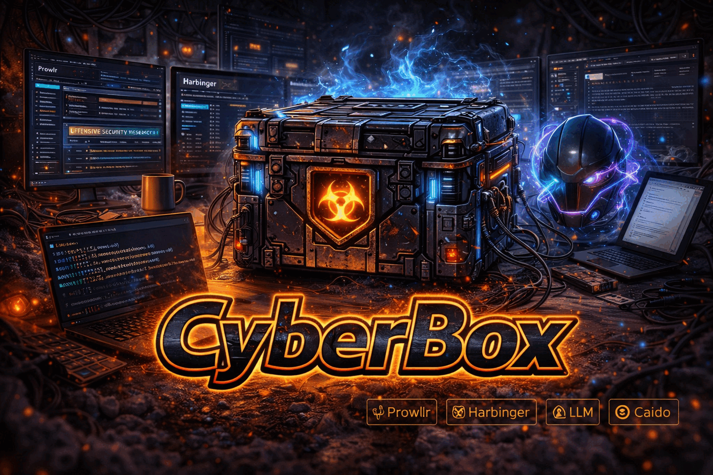

<p align="center">
  
</p>

<h1 align="center">CyberBox</h1>

<p align="center">
  <strong>Hardened Docker sandbox for bug bounty and offensive security research.</strong>
</p>

<p align="center">
  <a href="https://github.com/ProwlrBot/CyberBox/releases/latest"></a>
  <a href="https://github.com/ProwlrBot/CyberBox/actions"></a>
  <a href="https://github.com/ProwlrBot/CyberBox/blob/main/LICENSE"></a>
  <a href="https://prowlrbot.com/cyberbox/guide/trust"></a>
</p>

---

## Verify before you run

CyberBox is built to be **trusted by hunters running it against real targets**.
Every published image is **keyless-signed with cosign** (Sigstore Fulcio +
public Rekor transparency log), ships a full **SBOM**, carries **SLSA build
provenance**, and is gated on **Trivy CRITICAL** before publish. An
independent CI job re-verifies the signature and SBOM on a fresh runner —
[see `verify-supply-chain` in the workflow](.github/workflows/cybersandbox-build.yml).

```bash
IMAGE=ghcr.io/prowlrbot/cybersandbox
DIGEST=$(docker buildx imagetools inspect "${IMAGE}:latest" --format '{{ .Manifest.Digest }}')

cosign verify "${IMAGE}@${DIGEST}" \
  --certificate-identity-regexp "^https://github.com/ProwlrBot/CyberBox/.github/workflows/cybersandbox-build.yml@refs/" \
  --certificate-oidc-issuer https://token.actions.githubusercontent.com
```

A clean exit is the contract. If `cosign verify` fails, **don't run the
image**. Full walkthrough — SBOM inspection, Rekor lookup, local CI
reproduction — in the **[Supply-chain trust guide](https://prowlrbot.com/cyberbox/guide/trust)**.

This matters: the Checkmarx KICS and Trivy supply-chain incidents in
March-April 2026 made provenance an active operational concern. Most
hunter toolchains (Kali, BlackArch, ad-hoc Go installs) cannot offer this
end-to-end without re-architecting. CyberBox can — out of the box.

---

CyberBox pairs a hardened sandbox container with **Prowlr** (a Caido proxy plugin), **prowl** (autonomous hunt pipeline), and **csbx** (a community plugin manager). Built for the hunter who works out of Caido + Obsidian + a local LLM.

## What's in the box

| Component | Role |
|-----------|------|
| **cybersandbox** | Docker image with 160+ security tools, Ollama client, Metasploit, mounted wordlists volume |
| **Prowlr (Caido plugin)** | Scope enforcement, dual-LLM AI analysis (Claude + Ollama), embedded xterm.js terminal, Obsidian findings export, NemoClaw-style guardrails |
| **prowl** | Autonomous recon → scan → report pipeline; Fabric-style prompt patterns (`harbinger` kept as compatibility alias) |
| **csbx** | Plugin manager (Homebrew-tap style); pdtm-compatible install path for Go tools |
| **invoke-claude / invoke-ollama** | CLI wrappers for both AI providers with uniform flags |

## Quick start

**Container** (pulls the published image from GHCR):
```bash
docker pull ghcr.io/prowlrbot/cybersandbox:latest
docker compose up -d          # uses ./docker-compose.yaml in the repo root
```

If `docker compose` fails with `docker-credential-desktop.exe not found` on WSL, drop the stale credsStore: `sed -i 's/"credsStore": "desktop.exe",\?//' ~/.docker/config.json` (public images need no auth).

Building from source (contributors, custom mounts, Obsidian vault) uses `cybersandbox/docker-compose.dev.yml` — see [`cybersandbox/SETUP.md`](cybersandbox/SETUP.md).

**Caido plugins:**
- [`prowlr-v0.2.1.zip`](https://github.com/ProwlrBot/CyberBox/releases/latest) (this repo) — scope, AI analysis, Obsidian export, guardrails
- [ShadowShell](https://github.com/hahwul/ShadowShell) (hahwul, recommended companion) — multi-tab terminal with split panes, AI-CLI presets (Claude/Gemini/Codex), and `Cmd+J` drop-down overlay. Prowlr's terminal tab is intentionally minimal; ShadowShell covers the serious terminal workflow.

Install both via **Caido → Settings → Plugins → Install from file**.

**Host CLI:**
```bash
export ANTHROPIC_API_KEY=sk-ant-…
./prowl/bin/prowl status
./prowl/bin/prowl hunt example.com
./prowl/bin/prowl pattern analyze_vulns < request.txt
```

(`prowl` is the primary CLI name; `prowl` remains as a compatibility alias.)

## Security posture

Beyond the supply-chain story above, the runtime is hardened end-to-end:

- SSRF allowlist on all AI endpoints (`*.anthropic.com` https only for Claude)
- AI output always schema-validated before surfacing
- **NemoClaw-style guardrails** — 7 prompt-injection patterns filtered from traffic before hitting the LLM, 6 secret classes redacted from AI responses (sk-ant-*, AKIA*, ghp_*, JWTs, etc.)
- Per-provider AI rate limiter
- No hardcoded values — 15+ settings in the Prowlr UI, env vars for every CLI knob
- Container runs non-root, ports bound to 127.0.0.1, vault mounted read-only

See the **[Supply-chain trust guide](https://prowlrbot.com/cyberbox/guide/trust)**,
[`cybersandbox/SECURITY.md`](cybersandbox/SECURITY.md), and the hardening log
in the changelog.

## Plugin marketplace (csbx)

```bash
csbx search xss            # community registry
csbx install seclists      # big wordlists
csbx install gf-patterns
csbx pdtm subfinder        # pdtm-format Go tool install
csbx pdtm github.com/lc/gau/v2/cmd/gau   # raw go-install path
csbx list
```

Registry lives at [ProwlrBot/csbx-registry](https://github.com/ProwlrBot/csbx-registry) — PRs welcome.

## Repo layout

```
caido-plugin/       Prowlr Caido plugin (TypeScript, IIFE bundle)
cybersandbox/       Dockerfile, compose, SETUP, SECURITY, CHANGELOG
prowl/              bin/{prowl,harbinger,csbx,invoke-claude,invoke-ollama}
                    patterns/  Fabric-style prompt library
                    tests/     bash test harness (16 tests)
.github/            CI workflow, issue + PR templates
```

## Upstream attribution

This project originated as a fork of [agent-infra/sandbox](https://github.com/agent-infra/sandbox). The original README is preserved at [`UPSTREAM_README.md`](UPSTREAM_README.md). All CyberBox-specific code is under the same license as upstream.

Reference sources (patterns extracted, not cloned in bulk):
- [projectdiscovery](https://github.com/projectdiscovery) — nuclei/subfinder/httpx/katana + pdtm manifest format
- [danielmiessler](https://github.com/danielmiessler) — SecLists, Fabric prompt patterns
- [hahwul](https://github.com/hahwul) — dalfox, Caido plugin patterns, [ShadowShell](https://github.com/hahwul/ShadowShell) (recommended companion terminal plugin)
- [tomnomnom](https://github.com/tomnomnom) — waybackurls, gau
- [wshobson/agents](https://github.com/wshobson/agents) — Claude Code security subagents
- [NVIDIA NemoClaw](https://github.com/NVIDIA) — AI guardrail patterns

## Security

Report suspected vulnerabilities privately — see [SECURITY.md](SECURITY.md). Scope, hardening notes, and the disclosure window are in [`cybersandbox/SECURITY.md`](cybersandbox/SECURITY.md).

## License

See [`LICENSE`](LICENSE).

---

<p align="center">
  <a href="https://prowlrbot.com">prowlrbot.com</a> ·
  <a href="mailto:prowlr@proton.me">prowlr@proton.me</a>
</p>
