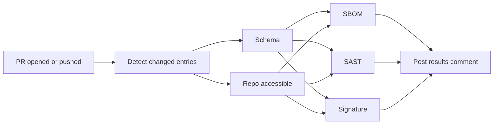

# Submit a plugin

[csbx-registry](https://github.com/ProwlrBot/csbx-registry) is the community
catalog of plugins discoverable via `csbx install` and `csbx search`. It
accepts pull requests from any plugin maintainer — you do **not** need to be
a CyberBox author. If your plugin is well-maintained and clears the intake
checks, it lands.

This page is the entry point. The full mechanics live in the registry repo:

- **Contribution guide** — [CONTRIBUTING.md](https://github.com/ProwlrBot/csbx-registry/blob/main/CONTRIBUTING.md)
- **Intake policy (what gets checked)** — [intake/POLICY.md](https://github.com/ProwlrBot/csbx-registry/blob/main/intake/POLICY.md)

## What kinds of plugins can I submit?

| Type | Use case | Intake policy |
|------|----------|---------------|
| `tool` | CLI binaries (Go, Rust, Python) | Standard |
| `wordlist` | Fuzzing / discovery / password lists | Standard |
| `nuclei-templates` | Scan templates for `nuclei` | Standard |
| `yara-rules` | YARA rules for malware analysis | Standard |
| `sigma` | Sigma detection rules for SIEM/EDR | Standard |
| `threat-intel` | IOC and threat-intel feeds | Standard |
| `theme` | Shell themes / prompts | Standard |
| `config` | Dotfiles, GF patterns, configs | Standard |
| `caido-plugin` | Plugins for the [Caido](https://caido.io) HTTP toolkit | **Strict** |

**Standard** intake = schema validation, repo accessibility, SBOM generation, informational SAST.
**Strict** intake = standard plus required cosign signature verification and **HIGH/CRITICAL SAST findings block merge**.

The strict path applies to `caido-plugin` because Caido plugins are
*executable* code that runs inside a security tool. The same supply-chain
story we tell for [the CyberBox image itself](./trust) applies here — keyless
cosign signatures, SBOMs, fail-closed CI gates — and we hold community
plugins to the same bar.

## How to submit

1. **Sign your release.** For `caido-plugin` entries this is required.
   Wire keyless cosign signing into your release workflow — the
   [intake policy](https://github.com/ProwlrBot/csbx-registry/blob/main/intake/POLICY.md#check-5--signature-verification-required-for-caido-plugin-skipped-for-others)
   has a copy-paste GitHub Actions snippet.
2. **Open a PR against `csbx-registry`** adding your entry to the right
   section of `registry.yaml`. See
   [CONTRIBUTING.md](https://github.com/ProwlrBot/csbx-registry/blob/main/CONTRIBUTING.md#required-fields)
   for the schema.
3. **Wait for the Plugin Intake Check workflow.** It runs five checks in
   parallel — schema, repo accessibility, SBOM, SAST, signature — and posts
   the consolidated result as a PR comment.
4. **Address any failed required checks** by pushing fixes; the workflow
   re-runs on each push.
5. **A maintainer reviews, downloads the SBOM and SAST artifacts, and
   merges** once required checks are green.

## What the intake workflow runs



Each check is a separate job, runs in parallel, and uploads its findings as
a workflow artifact. SBOM and SAST reports are downloadable from the run
page so reviewers (and you) can inspect them.

## Local pre-flight

Before opening the PR you can run the schema validator against your draft
entry. This catches the most common rejection reasons (missing fields,
wrong section, unsupported type) without leaving your laptop:

```bash
git clone https://github.com/ProwlrBot/csbx-registry
cd csbx-registry

# Edit registry.yaml with your draft entry, then:
./tests/run-intake.sh
```

The harness exits 0 if every entry currently in the file would pass schema
validation, non-zero otherwise.

## Why a community registry

Caido's plugin ecosystem is fragmented today — discovery happens via word
of mouth, install instructions vary by repo, and there is no
verification layer between "someone posted a plugin on GitHub" and "this
plugin is now running inside my proxy."

csbx-registry collapses that into one path:

- **Single discoverable index.** `csbx search caido` returns the catalog.
- **Verified at intake.** Signature, SBOM, SAST — see the [intake policy](https://github.com/ProwlrBot/csbx-registry/blob/main/intake/POLICY.md).
- **Verified at install.** `csbx install --caido <name>` re-runs the
  signature check before placing the plugin in `~/.caido/plugins/`.

The same supply-chain bar that
[CyberBox holds for its own image](./trust) is the bar we hold for
community-contributed plugins. Strict, but not arbitrary — every check is
documented, every threshold is published, and overrides are rare and
justified in the open.
